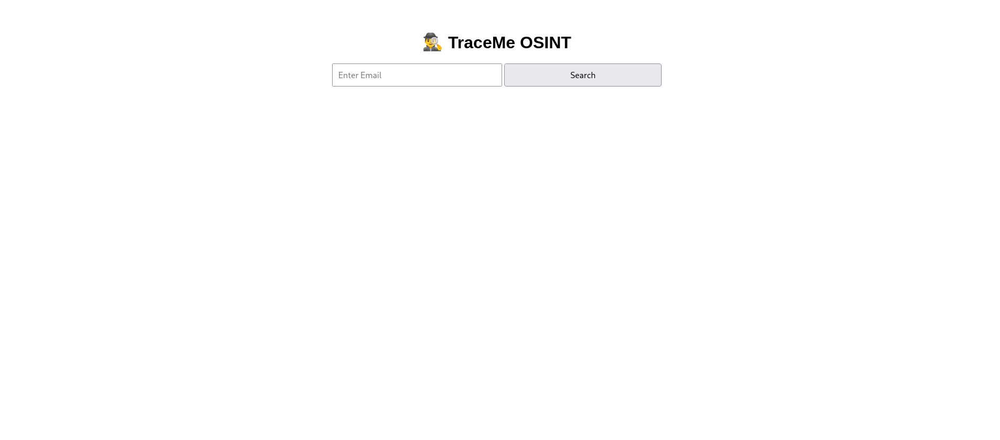

# TraceMe 

TraceMe is an OSINT-based cybersecurity project built using Flask and Sherlock.  
It helps identify where a given username exists across multiple online platforms.

## Features
- Username enumeration using Sherlock
- Clean Flask web interface
- Runs on Kali Linux
- Modular and extensible design

## Tech Stack
- Python
- Flask
- Sherlock
- Kali Linux
## Screenshots

### Home Page


### Results Page


- The result page gave me 4 real profiles of my username .

## NOTE
- The HoleHe CL tool is curently not working and taking too much time to search so , we stoped the tool to execute .
- Working on the holehe integration , focousing the main issue .
## Installation
```bash
git clone https://github.com/<your-username>/traceme.git
cd traceme
python3 -m venv venv
source venv/bin/activate
pip install -r requirements.txt
pip install sherlock-project
python app.py
